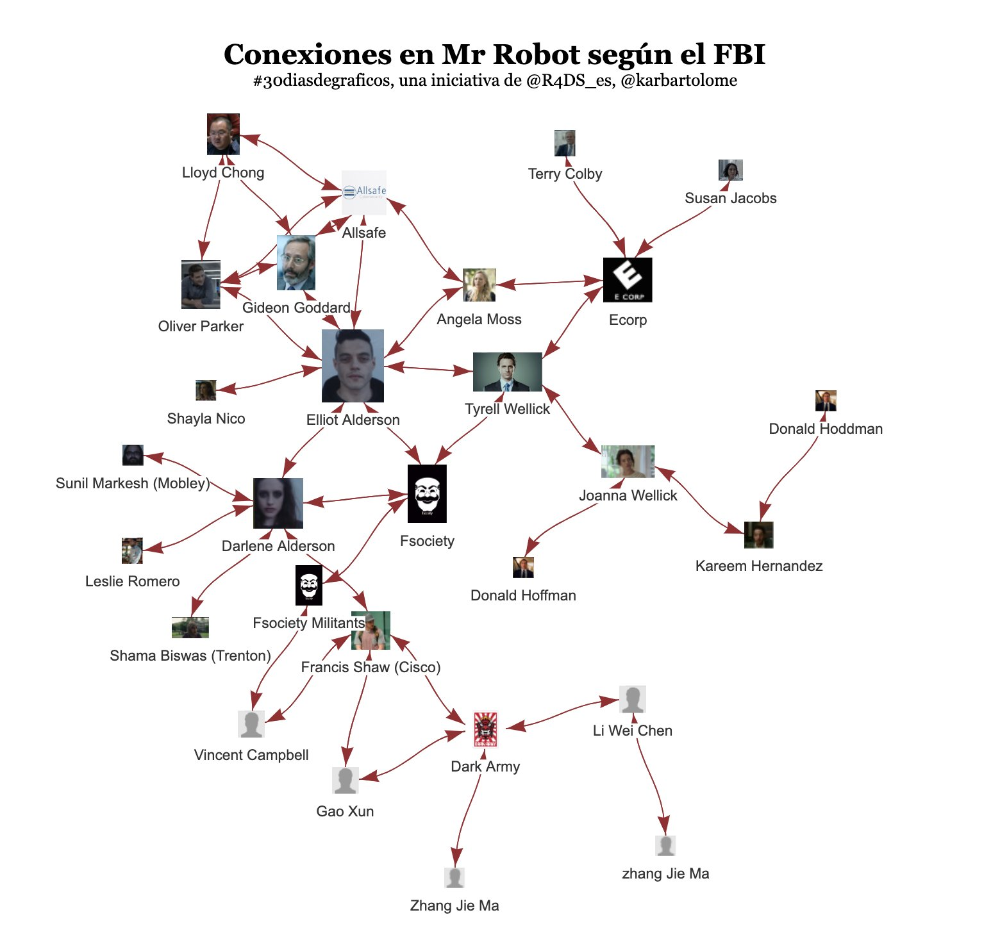
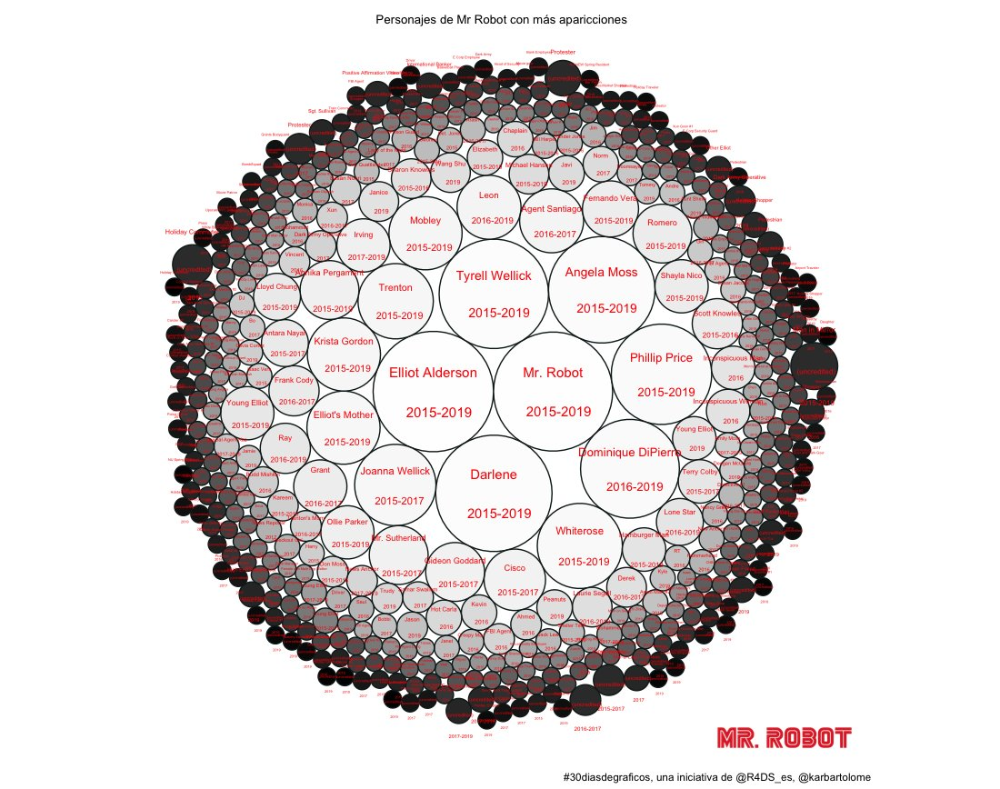
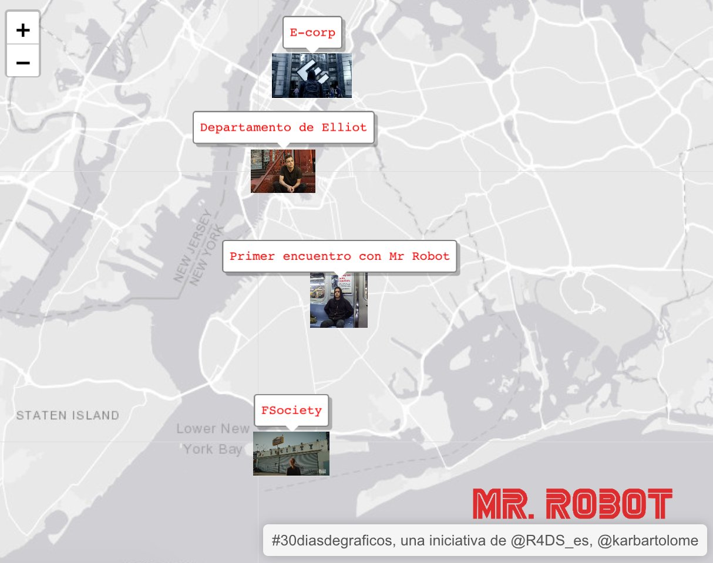
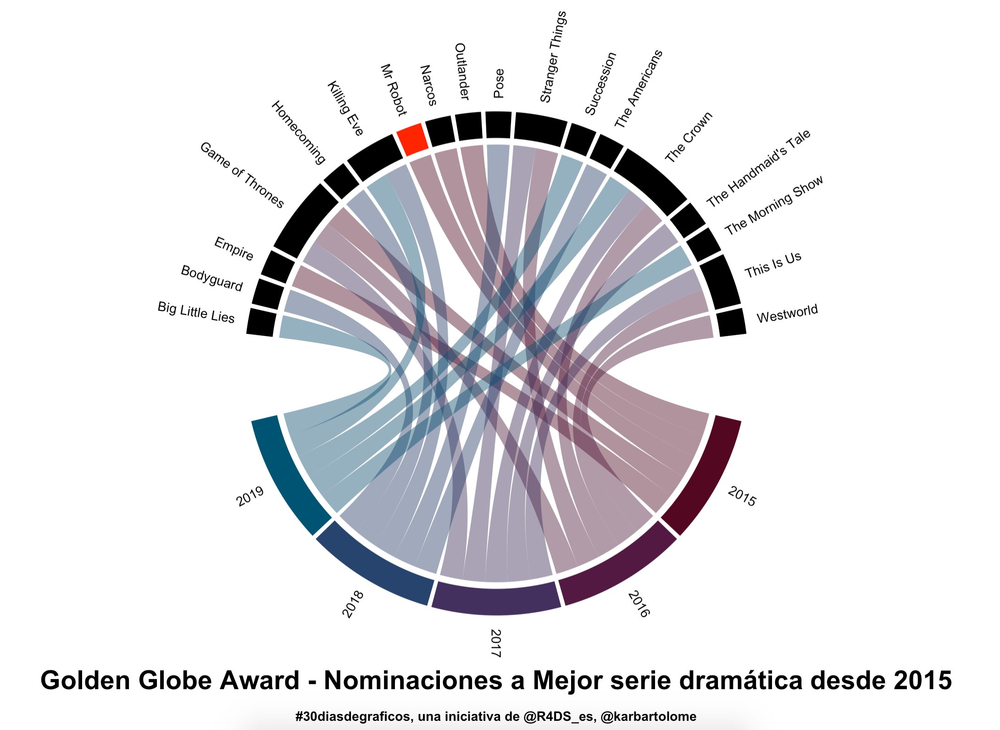
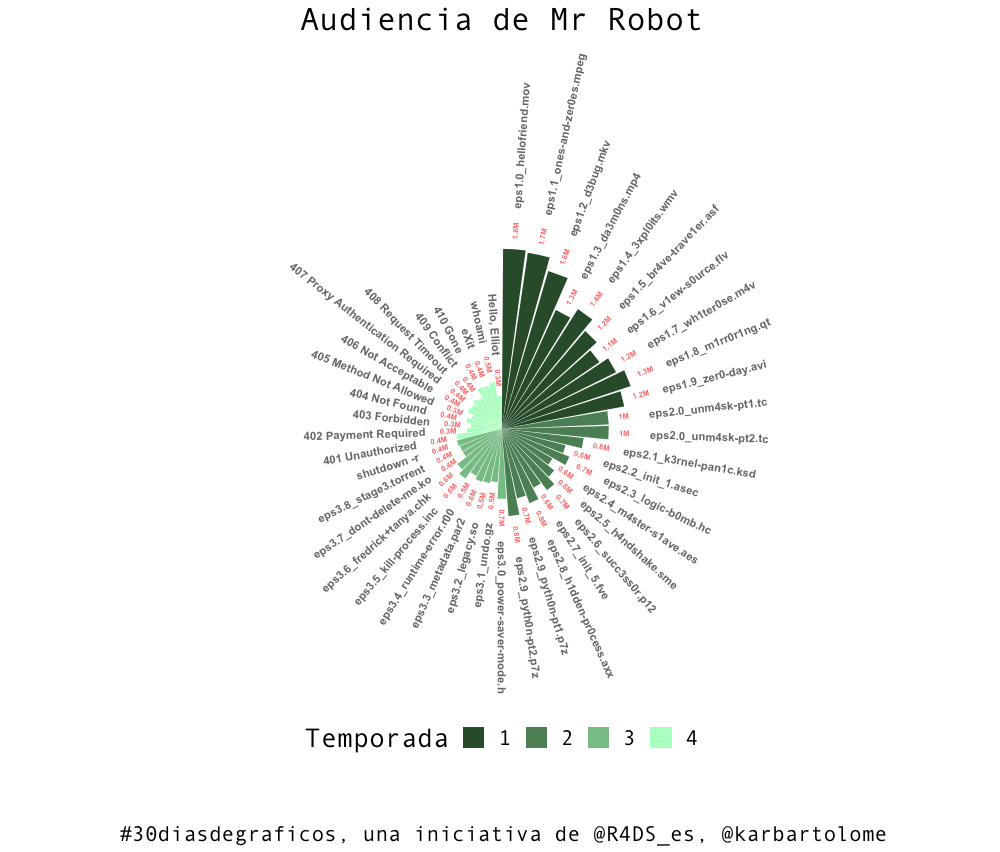
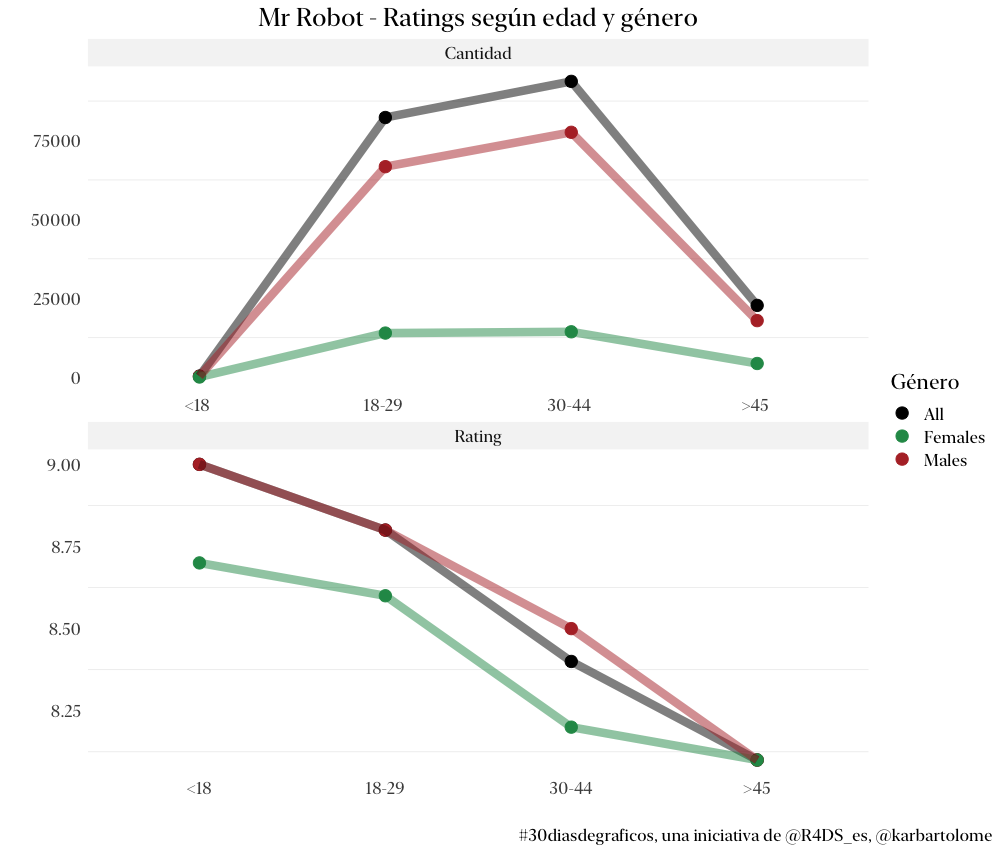

# 30diasdemrrobot

(quise que sean 30 días pero no fueron 30 días)

## Algunas visualizaciones:

1. Red de conexiones en Mr Robot según el FBI:

</img>

2. Bubbleplot de los personajes según cantidad de aparicciones en episodios:

</img>

3. Algunas ubicaciones de Mr Robot: 

</img>

4. Golden Globes - Mejor serie dramátics desde 2015 (en 2015 ganó Mr Robot)

</img>

5. Audiencia por episodio:

</img>

6. Reviews de usuarios en Imbd:

</img>

